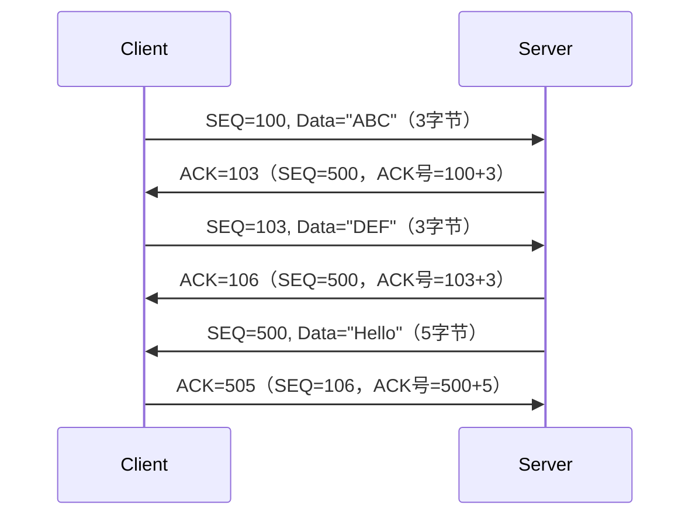

# TCP连接中ACK,SEQ变化

以下是 TCP 连接中 ACK 和 SEQ 交互变化的详细示例（包含完整的三次握手、数据传输和四次挥手过程）：

### 📡 连接建立阶段（三次握手）

1. **客户端 → 服务器**
   `SYN=1, SEQ=X`（随机初始序列号）
   *客户端声明自己的初始序列号 X*
2. **服务器 → 客户端**
   `SYN=1, ACK=1, SEQ=Y, ACK=X+1`
   *服务器确认收到 X（ACK=X+1）并声明自己的初始序列号 Y*
3. **客户端 → 服务器**
   `ACK=1, SEQ=X+1, ACK=Y+1`
   *客户端确认收到 Y（ACK=Y+1），准备开始数据传输*

------

### 📦 数据传输阶段

#### 🔄 交互规则：

1. **每次发送数据**：
   `SEQ = 上次SEQ + 数据长度`
   *（如客户端第一次 SEQ=100，发送3字节后，下次 SEQ=103）*
2. **ACK号计算**：
   `ACK = 对方SEQ + 接收数据长度`
   *（如服务器收到 SEQ=100的3字节数据，返回 ACK=103）*
3. **ACK包不携带数据时**：
   `SEQ 不变，只携带ACK号`
   *（纯ACK包不消耗序列号）*

------

### 🚪 连接关闭阶段（四次挥手）

1. **客户端 → 服务器**
   `FIN=1, SEQ=110, ACK=500`
   *客户端请求关闭（FIN消耗1序列号）*
2. **服务器 → 客户端**
   `ACK=1, SEQ=500, ACK=111`
   *确认收到 FIN（ACK=110+1）*
3. **服务器 → 客户端**
   `FIN=1, ACK=1, SEQ=505, ACK=111`
   *服务器发出 FIN（消耗1序列号）*
4. **客户端 → 服务器**
   `ACK=1, SEQ=111, ACK=506`
   *确认 FIN（ACK=505+1），等待2MSL后关闭*

------

### 🔍 关键规则总结：

| 操作              | SEQ 变化 | ACK 变化            |
| ----------------- | -------- | ------------------- |
| 发送SYN/FIN       | +1       | 不变                |
| 发送数据（N字节） | +N       | 不变                |
| 发送纯ACK包       | 不变     | 更新为期待的下个SEQ |
| 接收数据后ACK     | 不变     | =收到数据最后字节+1 |

> 📌 **重要说明**：
> ACK号总是​**​期望收到的下一个字节序号​**​（如收到SEQ=100的10字节数据，返回ACK=110）
> 初始序列号 (ISN) 是随机值（防止序列号预测攻击），后续SEQ基于ISN累加